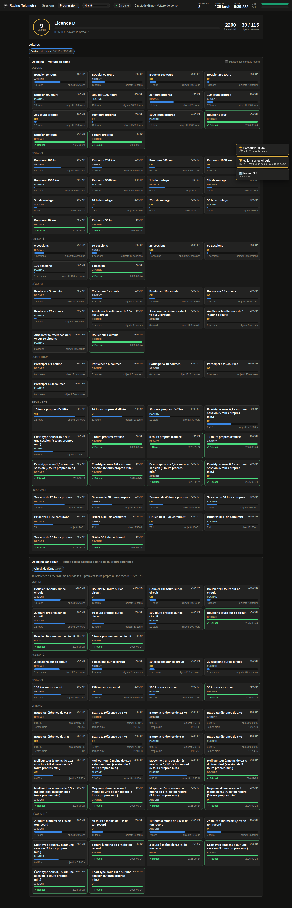
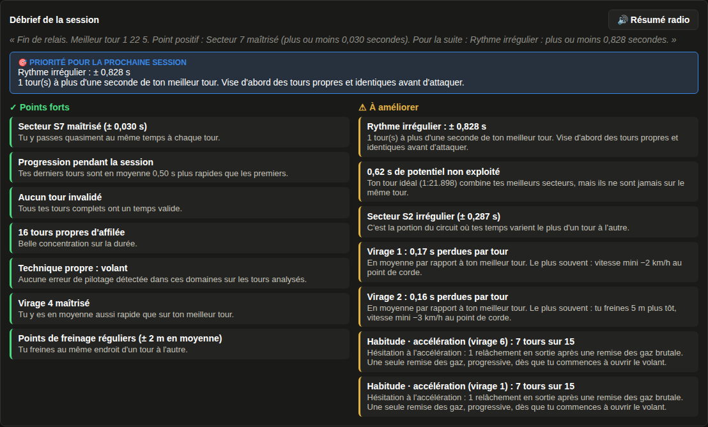
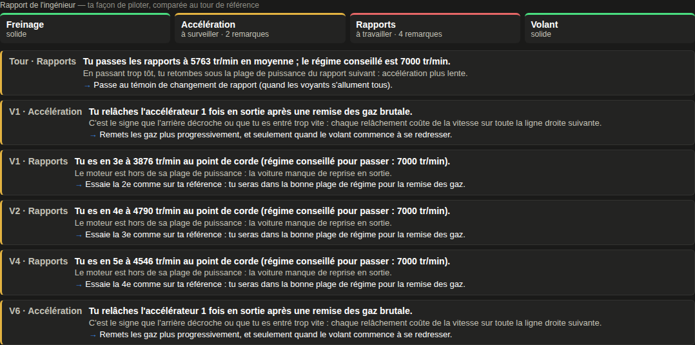
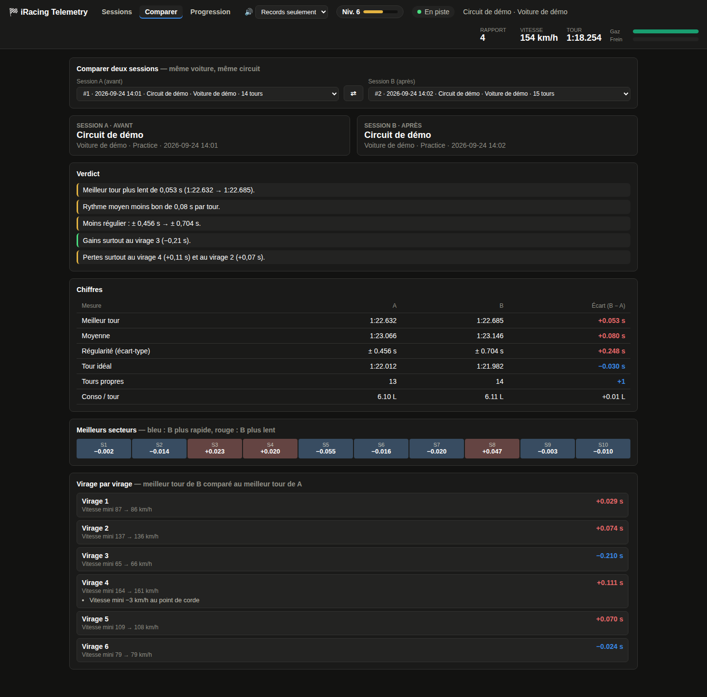
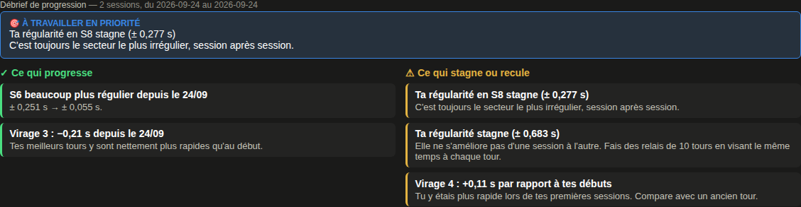
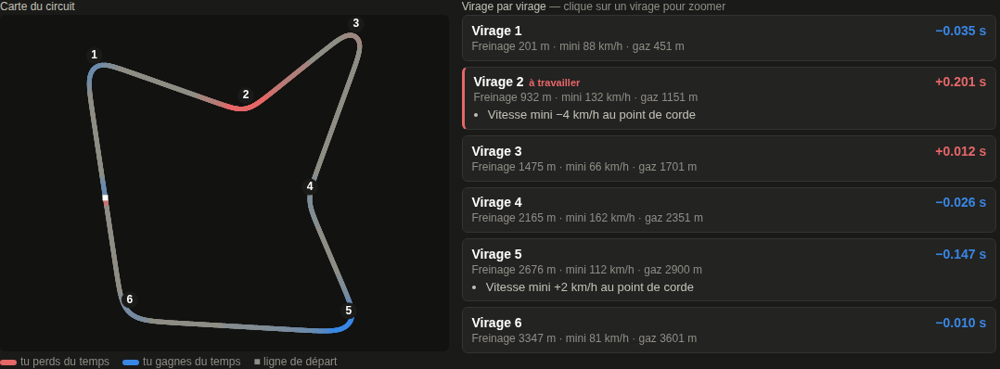
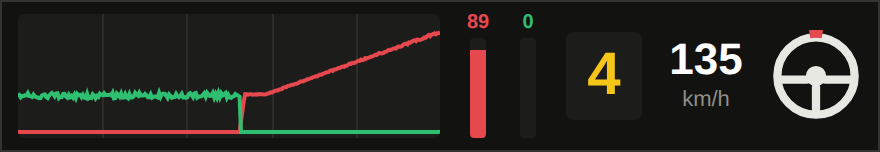

# iRacing Telemetry Logger

Une application qui enregistre automatiquement tes tours iRacing : **temps au tour, moyenne, régularité,
et télémétrie complète de l'accélérateur et du frein (60 mesures par seconde)**, avec une interface
graphique pour analyser où tu perds du temps. Tout est stocké en local dans une base SQLite, session
par session, et tu supprimes ce que tu veux depuis l'interface. 🏁




> **Windows uniquement pour la capture** : iRacing ne tourne que sous Windows, et ses données ne sont
> lisibles que depuis la même machine. Le mode démo, lui, fonctionne partout.

> **Statut : en développement actif.** Testé en conditions réelles sur iRacing : capture des tours, temps
> au tour, carte du circuit, voix, overlay et fenêtre de l'application fonctionnent. Les seuils de l'analyse
> de pilotage ont été réglés sur un petit nombre de sessions et peuvent être trop sévères ou trop gentils
> selon la voiture. Les retours et contributions sont les bienvenus : voir [Contribuer](#contribuer).

---

## Fonctionnalités

**Temps au tour**
- Temps officiel iRacing de chaque tour, écart au meilleur tour
- Meilleur tour, **moyenne**, **régularité** (écart-type) et **tour idéal** (somme de tes meilleurs secteurs)
- Graphique de l'évolution des temps au tour sur la session
- Tours marqués automatiquement : `stand` (passage par la pitlane) et `partiel` (enregistrement commencé
  en plein tour). Ils sont exclus du meilleur tour, de la moyenne et de la régularité.

**Débrief de session** : à chaque tour terminé, l'application écrit un débrief de la session avec des
**points forts**, des **points à améliorer** et **une priorité pour la prochaine session** (le point qui
fait perdre le plus de temps). Il porte sur :
- le record (nouveau record, ou écart avec ton record)
- la régularité, le tour idéal et le potentiel non exploité
- les secteurs les plus et les moins réguliers
- la progression pendant la session, les tours invalidés et les séries de tours propres
- la télémétrie : virages où tu perds le plus de temps en moyenne (avec la raison la plus fréquente :
  freinage trop tôt, vitesse mini trop basse, gaz trop tard…), régularité des points de freinage, roue libre

Le débrief apparaît à partir de 3 tours propres. L'analyse des virages compare tes 15 derniers tours propres
à ton meilleur tour de la session.



**Rapport de l'ingénieur** (dans la télémétrie de chaque tour) : l'analyse regarde **la forme** de tes courbes,
pas seulement les temps, et chaque remarque suit le schéma d'un ingénieur de course :
**observation → conséquence → action**. Par exemple :

> **V3 · Freinage.** Tu mets 0,30 s à atteindre ta pression de freinage maximale contre 0,05 s sur ta référence.
> Les premiers mètres de freinage, où la voiture a le plus d'appui, sont sous-exploités.
> → Attaque la pédale franchement d'un coup, puis dose en relâchant.

Ce qui est analysé, virage par virage :
- **Freinage :** vitesse d'attaque de la pédale, pression maximale, ABS, relâchement pendant que tu tournes
  (trail braking), frein et accélérateur enfoncés ensemble.
- **Accélération :** hésitations (tu relâches puis remets les gaz), remise des gaz brutale, temps pour passer à fond.
- **Rapports :** régime au point de corde (rapport trop long), passages de rapport trop tôt par rapport au témoin
  de la voiture, temps passé au rupteur.
- **Volant :** corrections répétées (voiture instable), sous-virage (plus de volant pour moins de G latéral).

Un **profil de pilotage** résume le tour (Freinage / Accélération / Rapports / Volant : solide, à surveiller,
à travailler). Un clic sur une remarque zoome les graphiques sur le virage. Le débrief de session signale aussi
tes **habitudes**, c'est-à-dire les erreurs qui reviennent sur au moins 40 % des tours
(« Habitude · freinage (virage 2) : 6 tours sur 15 »).

Pour que le rapport sonne moins « machine » :
- **Des formulations variées :** chaque type de remarque a plusieurs formulations (102 phrases au total). Le
  choix est stable pour un même tour : le rapport ne change pas quand tu le rouvres.
- **La mémoire des sessions précédentes :** les habitudes de chaque session sont enregistrées. Une remarque qui
  revient est signalée (« ↻ Déjà relevé lors de tes 2 dernières sessions : c'est une habitude à casser »,
  « C'est la 3e session d'affilée avec ce défaut »). Ce qui a disparu est salué (« Corrigé : freinage timide au
  virage 2 »).
- **Le résumé radio :** quand tu rentres au garage après au moins 3 tours propres, la voix fait un bilan en 2 ou
  3 phrases (« Fin de relais. Meilleur tour 1 22 5. Point positif : très régulier. Pour la suite : virage 1,
  0,17 secondes perdues par tour. »). Le bouton « 🔊 Résumé radio » du débrief le rejoue à tout moment.

Les graphiques de télémétrie affichent maintenant aussi le régime moteur (avec le régime de passage conseillé)
et l'accélération latérale. Tous les seuils sont regroupés en haut de `technique.py`. Ils dépendent de la
voiture, donc ajuste-les après tes premières vraies sessions. Les tours enregistrés avant cette version n'ont
pas le régime, les G ni l'ABS : leur analyse est partielle, et l'interface le signale.



**Coaching**
- **Comparer deux sessions** (onglet *Comparer*, ou bouton « Comparer… » dans une session) : même voiture,
  même circuit, côte à côte. Tu vois tes notes des deux sessions, un verdict (« meilleur tour plus rapide de
  0,21 s », « plus régulier », « gains surtout au virage 3 »), les chiffres avec l'écart B − A, les meilleurs
  secteurs et chaque virage (meilleur tour de B contre meilleur tour de A). C'est idéal pour savoir si un
  nouveau setup t'a fait gagner du temps.
- **Débrief de progression** (onglet *Progression*, pour chaque circuit) : c'est le débrief de session, mais sur
  toutes tes sessions. Tes premières sessions sont comparées aux plus récentes : record, rythme moyen,
  régularité, secteurs, et chaque virage par rapport à ton record. Exemples : « Virage 2 : −0,20 s depuis le
  03/09 », « Ta régularité en S5 stagne », « Virage 4 stagne ». Il faut au moins 2 sessions avec 3 tours propres.
- **Mode entraînement** : dans l'analyse virage par virage, « 🎯 S'entraîner sur ce virage ». Chaque passage dans
  ce virage est chronométré (entrée et sortie interpolées entre deux mesures) et comparé au même virage de ton
  record. L'overlay n'affiche plus que ce virage : l'écart en direct pendant le passage, puis le résultat.
  Un bandeau dans la session liste tes derniers passages. « Arrêter l'entraînement » revient au delta normal.
- **Annonces vocales** avec la synthèse vocale de Windows (rien à installer ; une voix française est utilisée si
  elle est présente). Choix dans la barre du haut :
  *Voix coupée*, *Records seulement* (« Record battu ! 1 22 4, moins 0 virgule 3 ») ou *Chaque tour*
  (« 1 22 8, plus 0 virgule 4 », « Objectif réussi »). En mode entraînement, chaque passage est annoncé
  (« Virage 3, moins 4 centièmes »), sauf si la voix est coupée. Le panneau ⚙ règle le volume et le débit
  de la voix, avec un bouton « Tester la voix ».





**Télémétrie**
- Enregistrement de **chaque tour à 60 Hz** : vitesse, **accélérateur**, **frein**, rapport engagé, angle du volant
  (≈ un point tous les 80 cm à 180 km/h)
- Comparaison d'un tour avec une référence alignée sur la distance. Par défaut, la référence est **ton record
  toutes sessions confondues** sur ce couple voiture × circuit (🏆), mais tu peux choisir n'importe quel tour.
- Courbe de **delta** : où tu perds et où tu gagnes du temps, mètre par mètre
- Temps perdu ou gagné sur **10 secteurs**
- **Analyse virage par virage** automatique : point de freinage, freinage maximal, vitesse minimale,
  remise des gaz, temps en roue libre et temps perdu sur la référence, avec des conseils du type
  « Tu freines 12 m plus tôt », « Vitesse mini −4 km/h au point de corde ». Les 3 virages qui coûtent
  le plus sont marqués « à travailler ». Un clic sur un virage zoome tous les graphiques dessus.
- **Carte du circuit** reconstituée à partir du cap et de la vitesse de la voiture, colorée selon le delta
  (rouge = tu perds du temps, bleu = tu en gagnes), avec les numéros de virage. Le curseur des graphiques
  y apparaît en direct.
- Curseur et zoom synchronisés sur tous les graphiques (glisser pour zoomer, double-clic pour revenir)



**Progression** : 115 objectifs par voiture et par circuit, XP et niveaux (voir plus bas).

**En direct**
- Statut de connexion, rapport, vitesse, chrono du tour, barres gaz et frein.
- **Overlay du delta** : une petite fenêtre toujours au premier plan, sans bordure et déplaçable à la souris.
  Elle affiche en direct ton écart avec ton record au même endroit de la piste, le temps prévu du tour,
  ton record, et la pression des pédales (gaz et frein) en barres verticales avec leur pourcentage. Pour qu'elle s'affiche par-dessus le jeu, lance iRacing en mode **fenêtré sans bordure**
  (borderless) : aucune fenêtre ne peut passer devant un jeu en plein écran exclusif. Tu peux la désactiver
  dans le panneau ⚙.



**Sessions**
- Une session est créée à chaque connexion et à chaque changement de session iRacing (essais → qualif → course),
  avec le circuit, la voiture et le type de session
- Historique complet dans la barre de gauche, **suppression d'une session** (avec toute sa télémétrie) en un clic
- **Nom de session modifiable** et **note libre** (« nouveau setup, moins d'appui »), enregistrés automatiquement
- **Suppression d'un tour** (trafic, incident…) pour qu'il ne fausse pas les stats. Uniquement dans les sessions
  de **course** : en essais et en qualif, tous les tours sont conservés.
- Export CSV des tours d'une session
- **Sauvegarde et restauration** de toute la base depuis la barre de gauche : sessions, télémétrie, objectifs
  et XP. Avant une restauration, une copie de sécurité de la base actuelle est gardée dans `data/`.
  La restauration est refusée pendant qu'iRacing est connecté.

---

## Installation

Prérequis : **Windows**, **iRacing**, **Python 3.9+** ([python.org](https://www.python.org/downloads/),
coche « Add Python to PATH » pendant l'installation).

```bash
git clone https://github.com/BrayanSLL/iracingTracker.git
cd iracingTracker

python -m venv venv
venv\Scripts\activate

pip install -r requirements.txt
```

Dans Git Bash, l'activation se fait avec `source venv/Scripts/activate`, et l'installation avec
`python -m pip install -r requirements.txt`.

Dépendances : `flask` (serveur local), `pyirsdk` (lecture d'iRacing), `pywebview` (fenêtre de l'application).

## Lancer l'application

```bash
python main.py
```

La fenêtre de l'application s'ouvre directement. Lance ensuite iRacing et monte en piste : la session
apparaît toute seule, et chaque tour s'ajoute environ une seconde après le passage de la ligne.
L'application peut rester ouverte en permanence, elle se reconnecte toute seule quand iRacing démarre ou s'arrête.

| Option | Effet |
|---|---|
| `--demo` | Voiture simulée sur un circuit de 4 km, pour essayer sans iRacing |
| `--demo-speed 10` | Démo accélérée (10× plus rapide) |
| `--browser` | Ouvre l'interface dans le navigateur au lieu d'une fenêtre |
| `--no-gui` | Serveur seul, interface à ouvrir à la main sur `http://127.0.0.1:5000` |
| `--no-overlay` | N'ouvre pas la fenêtre du delta en direct pour ce lancement. Pour la désactiver durablement : ⚙ → « Fenêtre du delta en direct ». Elle reste accessible sur `http://127.0.0.1:5000/overlay`. |
| `--port 5001` | Change le port local |

Pour essayer tout de suite : `python main.py --demo --demo-speed 10`

---

## Comment ça marche

```
iRacing ──(mémoire partagée, 60 Hz)──▶ telemetry.py ──▶ data/sessions.db (SQLite)
                                           │                    │
                                     analysis.py ◀──────────────┤
                                                                │
          fenêtre (pywebview) ◀──(JSON)── main.py (Flask) ◀─────┘
```

iRacing **n'envoie rien sur le réseau** : il publie sa télémétrie dans une zone de **mémoire partagée**
Windows, mise à jour 60 fois par seconde, et signale chaque mise à jour par un événement Windows.
`telemetry.py` attend cet événement, ce qui permet de ne rater aucun échantillon.

| Fichier | Rôle |
|---|---|
| `main.py` | Point d'entrée : lance la capture, le serveur local et la fenêtre |
| `telemetry.py` | Lecture d'iRacing (via [`pyirsdk`](https://github.com/kutu/pyirsdk)), détection des tours, enregistrement des traces |
| `analysis.py` | Nettoyage des traces, secteurs, alignement de deux tours, delta, statistiques, virages, carte |
| `db.py` | Base SQLite (sessions, tours, traces) |
| `debrief.py` | Débrief d'une session, comparaison de deux sessions, débrief de progression sur plusieurs sessions |
| `technique.py` | Analyse du pilotage façon ingénieur (freinage, accélération, rapports, volant) |
| `voice.py` | Annonces vocales (synthèse vocale de Windows via PowerShell) |
| `objectives.py` | Objectifs (modèles, réplication par voiture et circuit, évaluation), XP et niveaux |
| `demo.py` | Faux iRacing pour la démo et les tests |
| `templates/`, `static/` | Interface (graphiques avec [uPlot](https://github.com/leeoniya/uPlot), inclus dans le repo : aucun accès internet nécessaire) |
| `tests/` | Tests automatiques : `python -m unittest discover tests` |

### Détails importants

- **Détection du tour** : on surveille `LapCompleted`. Au passage de la ligne, `LapLastLapTime` contient
  souvent encore le temps du tour *précédent* : on attend qu'il change (3 s maximum) avant d'enregistrer.
  Si iRacing ne donne pas de temps valide (`-1`), le tour est gardé sans temps.
- **Trace du tour** : chaque échantillon contient le temps depuis le début du tour, la position sur le tour
  (`LapDistPct`, de 0 à 1), la vitesse, l'accélérateur, le frein, le rapport, le volant, le cap (`YawNorth`),
  le régime, les accélérations latérale et longitudinale, l'ABS et l'embrayage. Les échantillons
  « de l'autre côté de la ligne » sont retirés. Chaque trace est compressée (environ 100 Ko par tour).
- **Comparaison** : les deux tours sont ré-échantillonnés sur la même grille de distance. Le delta est
  la différence de temps au même endroit de la piste.
- **Secteurs** : le tour est découpé en 10 portions de même longueur. Le **tour idéal** est la somme des
  meilleurs secteurs des tours propres de la session.
- **Virages** : ils sont repérés automatiquement par les minimums de vitesse (au moins 12 km/h de perte)
  sur le tour de référence. Le point de freinage est le premier point où le frein dépasse 10 %, et la remise
  des gaz le premier point après la corde où l'accélérateur dépasse 50 %.
- **Carte** : iRacing ne donne pas de coordonnées GPS en direct. Le tracé est reconstitué en intégrant la
  vitesse selon le cap, puis la petite dérive accumulée est corrigée pour refermer la boucle. Les tours
  enregistrés avant cette version n'ont pas le cap et n'ont donc pas de carte.
- **Delta en direct** : au démarrage d'une session, la trace de ton record sur ce couple voiture × circuit
  est chargée. À chaque instant, le delta est ton temps depuis la ligne moins le temps du record au même
  endroit de la piste. Si tu bats ton record, il devient la nouvelle référence dès le tour suivant.
- **Suppression** : supprimer une session efface ses tours et ses traces, puis compacte la base.
  La session en cours d'enregistrement ne peut pas être supprimée.

### Base de données (`data/sessions.db`)

| Table | Contenu |
|---|---|
| `sessions` | date, nom, note, circuit, longueur du circuit, voiture, type de session |
| `laps` | numéro, temps, secteurs, carburant consommé et restant, vitesse max, gaz et frein moyens, marquage |
| `traces` | télémétrie 60 Hz du tour (JSON compressé) |
| `cars`, `car_tracks` | voitures et couples voiture × circuit connus |
| `objectives` | objectifs répliqués pour chaque voiture et circuit : valeur actuelle, date de réussite, XP |
| `xp_events` | historique de l'XP gagnée |
| `habit_runs`, `session_habits` | habitudes de pilotage de chaque session (pour le suivi d'une session à l'autre) |
| `settings` | réglages (annonces vocales, volume, débit, overlay) |

Le dossier `data/` est ignoré par git : tes sessions restent sur ta machine.

---

## Progression : objectifs, XP et niveaux 🏆

L'onglet **Progression** transforme tes sessions en jeu.

- **115 modèles d'objectifs** : 71 par voiture (volume, distance, assiduité, découverte de circuits,
  courses, séries de tours propres, régularité, endurance, carburant) et 44 par couple voiture × circuit
  (volume, chrono, régularité, tour idéal).
- **Réplication automatique** : la première fois que tu roules avec une voiture inconnue, elle est ajoutée
  à la base avec tous ses objectifs. Même chose pour chaque nouveau circuit avec cette voiture. La MX-5 et
  la GR86 ont donc chacune leur propre progression, et chaque circuit a la sienne.
- **Des objectifs de chrono toujours réalisables** : ils ne sont jamais en temps absolu. Ta **référence** est
  le meilleur de tes 3 premiers tours propres sur ce couple voiture × circuit. Les objectifs demandent de la
  battre de 0,5 % à 6 %, et l'interface affiche le vrai temps cible (par exemple « Temps cible 1:32.450 »).
  Un circuit de 5 km ne te demandera donc jamais un tour en 1:00.
- **Paliers et XP** : Bronze 50 XP, Argent 100 XP, Or 200 XP, Platine 400 XP.
- **Niveaux** : il faut 200 XP pour le niveau 2, puis 100 XP de plus à chaque niveau. Titres : Rookie →
  Licence D → C → B → A → Pro → Pro/WC → Légende.
- **Notifications** à chaque objectif débloqué et à chaque passage de niveau, pendant que tu roules.
- Au démarrage, les objectifs sont recalculés sur les sessions déjà enregistrées.
- Supprimer une session ne retire pas les objectifs déjà réussis ni leur XP.
- **Historique du record** : pour chaque circuit, une courbe montre l'évolution de ton record semaine après
  semaine, avec le meilleur tour de chaque session.
- Pour ajouter des objectifs, modifie `CAR_TEMPLATES` ou `TRACK_TEMPLATES` dans `objectives.py`. Ils sont
  ajoutés automatiquement à toutes les voitures au prochain tour.

## Ce que les données permettent de conclure

**Sur la session (temps au tour)**
- **Régularité** : un écart-type sous 0,3 s veut dire que tu es régulier. Au-dessus d'1 s, il y a des erreurs ou du trafic.
  C'est souvent un meilleur indicateur de progrès que le meilleur tour.
- **Tour idéal vs meilleur tour** : l'écart est le temps que tu *sais* faire, mais pas encore sur un même tour.
- **Évolution des temps** : des temps qui remontent en fin de relais indiquent l'usure des pneus, la fatigue ou l'évolution de la piste.
- **Carburant** : la conso moyenne par tour sert à calculer le plein pour une course.

**Sur un tour (télémétrie vs ta référence)**
- **Où** tu perds du temps : la pente du delta et les secteurs en rouge.
- **Freinage** : un freinage qui commence plus tôt que sur la référence, ou une pression maximale plus faible.
- **Relâchement du frein** : un frein relâché d'un coup avant de tourner, ou progressivement en entrant dans le virage (trail braking).
- **Remise des gaz** : trop tardive, ou brutale puis corrigée (le gaz remonte puis redescend).
- **Roue libre** : zones sans gaz ni frein, presque toujours du temps perdu.
- **Vitesse minimale en virage** : trop vite à l'entrée, puis une sortie plus lente ?

⚠️ Il faut toujours comparer ce qui est comparable : même voiture, même circuit, conditions proches.
Un tour gêné par le trafic fausse aussi la comparaison.

## Limites du SDK iRacing

- Rien n'est enregistré en replay ou en spectateur, seulement quand tu pilotes.
- Les **températures et l'usure des pneus** ne sont mises à jour **qu'aux stands**. La température des freins et les dégâts ne sont pas disponibles.
- Pour les autres pilotes, seuls les temps et positions des voitures de ta session sont accessibles, pas leur télémétrie.

## Feuille de route

Idées ouvertes aux contributions. Si l'une d'elles t'intéresse, ouvre d'abord une issue pour en discuter.

1. **Import des fichiers `.ibt`** enregistrés par iRacing : anciennes sessions, tours d'autres pilotes comme
   référence, coordonnées GPS exactes pour la carte
2. **Fantôme et autres voitures :** voir ce que le SDK expose (`CarIdx…`) et s'en servir comme référence partielle
3. **Objectifs de pilotage** tirés de l'analyse des virages (« aucun virage avec plus de 0,5 s de roue libre »…)
4. **Défis de la semaine** avec bonus d'XP
5. **Incidents** (`PlayerCarMyIncidentCount`) : dans le débrief et en objectifs « tours sans incident »
6. **Stratégie carburant** en course : tours restants et quantité à remettre
7. **Seuils par catégorie de voiture** (MX-5, GT3, formule…) pour l'analyse de pilotage
8. **Traduction** de l'interface (l'application est aujourd'hui en français)
9. **Lancement en un clic** (exécutable avec PyInstaller, raccourci sur le Bureau)

---

## Contribuer

Les contributions sont les bienvenues : rapports de bugs, idées, corrections et nouvelles fonctionnalités.

- **Un bug ?** Ouvre une [issue](../../issues/new/choose) avec le modèle « Bug ». Précise la voiture, le circuit,
  le type de session et, si possible, ce qu'affiche la console.
- **Une idée ?** Ouvre une issue avec le modèle « Idée de fonctionnalité » avant de coder, pour en discuter.
- **Du code ?** Lis [CONTRIBUTING.md](CONTRIBUTING.md) : installation, mode démo, tests, organisation du
  code et conventions.

Pas besoin d'iRacing pour contribuer : le mode démo (`python main.py --demo`) simule une voiture complète, et
les tests automatiques tournent sur n'importe quel système.

## Licence

[MIT](LICENSE) : tu peux utiliser, modifier et redistribuer ce code librement, à condition de conserver la mention
de copyright. La bibliothèque de graphiques [uPlot](https://github.com/leeoniya/uPlot), incluse dans
`static/vendor/`, est elle aussi sous licence MIT.

Ce projet n'est ni affilié à iRacing.com Motorsport Simulations, ni soutenu par cette société.

---

## Dépannage

| Problème | Solution |
|---|---|
| Statut « Hors ligne » | iRacing n'est pas lancé, ou tu es encore dans le launcher. Lance une session. |
| « Connecté » mais aucun tour | Tu n'es pas dans la voiture (garage, replay). Monte en piste et termine un tour complet. |
| Le premier tour est marqué « stand » | Normal : c'est l'out-lap. |
| La fenêtre ne s'ouvre pas | L'application ouvre alors le navigateur. Tu peux aussi utiliser `python main.py --browser`. Sur Windows, pywebview a besoin de Microsoft Edge WebView2, déjà installé sur Windows 10 et 11 à jour. |
| `ModuleNotFoundError` | Active l'environnement virtuel (`venv\Scripts\activate`), puis relance `pip install -r requirements.txt`. |
| Pas de voix | Vérifie le réglage 🔊 dans la barre du haut, puis ⚙ → « Tester la voix ». Sans voix française installée (Paramètres Windows → Heure et langue → Voix), Windows lit avec sa voix par défaut. |
| La voix est couverte par le jeu | Elle est déjà au maximum de la synthèse vocale de Windows. Dans le **mélangeur de volume** de Windows (clic droit sur l'icône du son), monte « Windows PowerShell » et baisse iRacing, ou baisse le volume général dans les options audio d'iRacing. Le débit « Lent » (⚙) rend aussi la voix plus compréhensible. |
| L'overlay n'apparaît pas par-dessus le jeu | Passe iRacing en mode fenêtré sans bordure (Options → Graphismes). |
| Je n'utilise pas l'overlay | ⚙ → décoche « Fenêtre du delta en direct » : il ne s'ouvrira plus au prochain lancement. |
| Port 5000 déjà utilisé | `python main.py --port 5001` |

## Ressources

- [pyirsdk](https://github.com/kutu/pyirsdk) : bibliothèque Python pour le SDK iRacing, avec la liste des variables disponibles
- Forum iRacing, section *SDK* : documentation officielle

**Bonne course ! 🏁**
