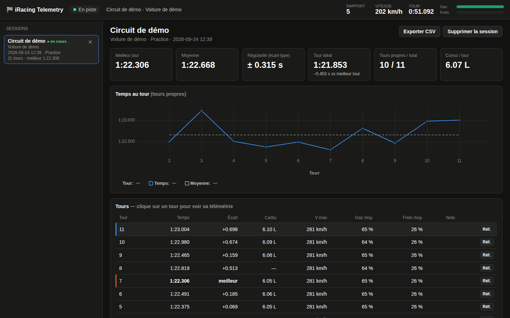

# iRacing Telemetry Logger

Une application qui enregistre automatiquement tes tours iRacing : **temps au tour, moyenne, régularité,
et télémétrie complète de l'accélérateur et du frein (60 mesures par seconde)**, avec une interface
graphique pour analyser où tu perds du temps. Tout est stocké en local dans une base SQLite, session
par session, et tu supprimes ce que tu veux depuis l'interface. 🏁



> **Windows uniquement pour la capture** : iRacing ne tourne que sous Windows, et ses données ne sont
> lisibles que depuis la même machine. Le mode démo, lui, fonctionne partout.

---

## Fonctionnalités

**Temps au tour**
- Temps officiel iRacing de chaque tour, écart au meilleur tour
- Meilleur tour, **moyenne**, **régularité** (écart-type) et **tour idéal** (somme de tes meilleurs secteurs)
- Graphique de l'évolution des temps au tour sur la session
- Tours marqués automatiquement : `stand` (passage par la pitlane) et `partiel` (enregistrement commencé
  en plein tour). Ils sont exclus du meilleur tour, de la moyenne et de la régularité.

**Télémétrie**
- Enregistrement de **chaque tour à 60 Hz** : vitesse, **accélérateur**, **frein**, rapport engagé, angle du volant
  (≈ un point tous les 80 cm à 180 km/h)
- Comparaison d'un tour avec une référence (par défaut ton meilleur tour), alignés sur la distance
- Courbe de **delta** : où tu perds et où tu gagnes du temps, mètre par mètre
- Temps perdu ou gagné sur **10 secteurs**
- Curseur et zoom synchronisés sur tous les graphiques (glisser pour zoomer, double-clic pour revenir)

**En direct** : statut de connexion, rapport, vitesse, chrono du tour, barres gaz et frein.

**Sessions**
- Une session est créée à chaque connexion et à chaque changement de session iRacing (essais → qualif → course),
  avec le circuit, la voiture et le type de session
- Historique complet dans la barre de gauche, **suppression d'une session** (avec toute sa télémétrie) en un clic
- Export CSV des tours d'une session

---

## Installation

Prérequis : **Windows**, **iRacing**, **Python 3.9+** ([python.org](https://www.python.org/downloads/),
coche « Add Python to PATH » pendant l'installation).

```bash
git clone https://github.com/BrayanSLL/iracingTracker.git
cd iracingTracker

python -m venv venv
venv\Scripts\activate

pip install -r requirements.txt
```

Dépendances : `flask` (serveur local), `pyirsdk` (lecture d'iRacing), `pywebview` (fenêtre de l'application).

## Lancer l'application

```bash
python main.py
```

La fenêtre de l'application s'ouvre directement. Lance ensuite iRacing et monte en piste : la session
apparaît toute seule, et chaque tour s'ajoute environ une seconde après le passage de la ligne.
L'application peut rester ouverte en permanence, elle se reconnecte toute seule quand iRacing démarre ou s'arrête.

| Option | Effet |
|---|---|
| `--demo` | Voiture simulée sur un circuit de 4 km, pour essayer sans iRacing |
| `--demo-speed 10` | Démo accélérée (10× plus rapide) |
| `--browser` | Ouvre l'interface dans le navigateur au lieu d'une fenêtre |
| `--no-gui` | Serveur seul, interface à ouvrir à la main sur `http://127.0.0.1:5000` |
| `--port 5001` | Change le port local |

Pour essayer tout de suite : `python main.py --demo --demo-speed 10`

---

## Comment ça marche

```
iRacing ──(mémoire partagée, 60 Hz)──▶ telemetry.py ──▶ data/sessions.db (SQLite)
                                           │                    │
                                     analysis.py ◀──────────────┤
                                                                │
          fenêtre (pywebview) ◀──(JSON)── main.py (Flask) ◀─────┘
```

iRacing **n'envoie rien sur le réseau** : il publie sa télémétrie dans une zone de **mémoire partagée**
Windows, mise à jour 60 fois par seconde, et signale chaque mise à jour par un événement Windows.
`telemetry.py` attend cet événement, ce qui permet de ne rater aucun échantillon.

| Fichier | Rôle |
|---|---|
| `main.py` | Point d'entrée : lance la capture, le serveur local et la fenêtre |
| `telemetry.py` | Lecture d'iRacing (via [`pyirsdk`](https://github.com/kutu/pyirsdk)), détection des tours, enregistrement des traces |
| `analysis.py` | Nettoyage des traces, secteurs, alignement de deux tours, delta, statistiques |
| `db.py` | Base SQLite (sessions, tours, traces) |
| `demo.py` | Faux iRacing pour la démo et les tests |
| `templates/`, `static/` | Interface (graphiques avec [uPlot](https://github.com/leeoniya/uPlot), inclus dans le repo : aucun accès internet nécessaire) |
| `tests/` | Tests automatiques : `python -m unittest discover tests` |

### Détails importants

- **Détection du tour** : on surveille `LapCompleted`. Au passage de la ligne, `LapLastLapTime` contient
  souvent encore le temps du tour *précédent* : on attend qu'il change (3 s maximum) avant d'enregistrer.
  Si iRacing ne donne pas de temps valide (`-1`), le tour est gardé sans temps.
- **Trace du tour** : chaque échantillon contient le temps depuis le début du tour, la position sur le tour
  (`LapDistPct`, de 0 à 1), la vitesse, l'accélérateur, le frein, le rapport et le volant. Les échantillons
  « de l'autre côté de la ligne » sont retirés. Chaque trace est compressée (environ 100 Ko par tour).
- **Comparaison** : les deux tours sont ré-échantillonnés sur la même grille de distance. Le delta est
  la différence de temps au même endroit de la piste.
- **Secteurs** : le tour est découpé en 10 portions de même longueur. Le **tour idéal** est la somme des
  meilleurs secteurs des tours propres de la session.
- **Suppression** : supprimer une session efface ses tours et ses traces, puis compacte la base.
  La session en cours d'enregistrement ne peut pas être supprimée.

### Base de données (`data/sessions.db`)

| Table | Contenu |
|---|---|
| `sessions` | date, circuit, longueur du circuit, voiture, type de session |
| `laps` | numéro, temps, secteurs, carburant consommé et restant, vitesse max, gaz et frein moyens, marquage |
| `traces` | télémétrie 60 Hz du tour (JSON compressé) |

Le dossier `data/` est ignoré par git : tes sessions restent sur ta machine.

---

## Ce que les données permettent de conclure

**Sur la session (temps au tour)**
- **Régularité** : un écart-type sous 0,3 s veut dire que tu es régulier. Au-dessus d'1 s, il y a des erreurs ou du trafic.
  C'est souvent un meilleur indicateur de progrès que le meilleur tour.
- **Tour idéal vs meilleur tour** : l'écart est le temps que tu *sais* faire, mais pas encore sur un même tour.
- **Évolution des temps** : des temps qui remontent en fin de relais indiquent l'usure des pneus, la fatigue ou l'évolution de la piste.
- **Carburant** : la conso moyenne par tour sert à calculer le plein pour une course.

**Sur un tour (télémétrie vs ta référence)**
- **Où** tu perds du temps : la pente du delta et les secteurs en rouge.
- **Freinage** : un freinage qui commence plus tôt que sur la référence, ou une pression maximale plus faible.
- **Relâchement du frein** : un frein relâché d'un coup avant de tourner, ou progressivement en entrant dans le virage (trail braking).
- **Remise des gaz** : trop tardive, ou brutale puis corrigée (le gaz remonte puis redescend).
- **Roue libre** : zones sans gaz ni frein, presque toujours du temps perdu.
- **Vitesse minimale en virage** : trop vite à l'entrée, puis une sortie plus lente ?

⚠️ Il faut toujours comparer ce qui est comparable : même voiture, même circuit, conditions proches.
Un tour gêné par le trafic fausse aussi la comparaison.

## Limites du SDK iRacing

- Rien n'est enregistré en replay ou en spectateur, seulement quand tu pilotes.
- Les **températures et l'usure des pneus** ne sont mises à jour **qu'aux stands**. La température des freins et les dégâts ne sont pas disponibles.
- Pour les autres pilotes, seuls les temps et positions des voitures de ta session sont accessibles, pas leur télémétrie.

## Idées pour la suite

1. Comparer avec le meilleur tour d'**une autre session** (même circuit, même voiture)
2. Détection automatique des points de freinage et des zones de roue libre, virage par virage
3. Carte du circuit (`Lat` / `Lon`) colorée par le delta
4. Stratégie carburant en course : tours restants et quantité à remettre
5. Import des fichiers `.ibt` enregistrés par iRacing

---

## Dépannage

| Problème | Solution |
|---|---|
| Statut « Hors ligne » | iRacing n'est pas lancé, ou tu es encore dans le launcher. Lance une session. |
| « Connecté » mais aucun tour | Tu n'es pas dans la voiture (garage, replay). Monte en piste et termine un tour complet. |
| Le premier tour est marqué « stand » | Normal : c'est l'out-lap. |
| La fenêtre ne s'ouvre pas | L'application ouvre alors le navigateur. Tu peux aussi utiliser `python main.py --browser`. Sur Windows, pywebview a besoin de Microsoft Edge WebView2, déjà installé sur Windows 10 et 11 à jour. |
| `ModuleNotFoundError` | Active l'environnement virtuel (`venv\Scripts\activate`), puis relance `pip install -r requirements.txt`. |
| Port 5000 déjà utilisé | `python main.py --port 5001` |

## Ressources

- [pyirsdk](https://github.com/kutu/pyirsdk) : bibliothèque Python pour le SDK iRacing, avec la liste des variables disponibles
- Forum iRacing, section *SDK* : documentation officielle

**Bonne course ! 🏁**
